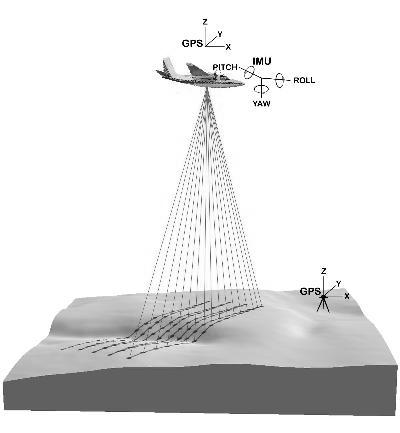
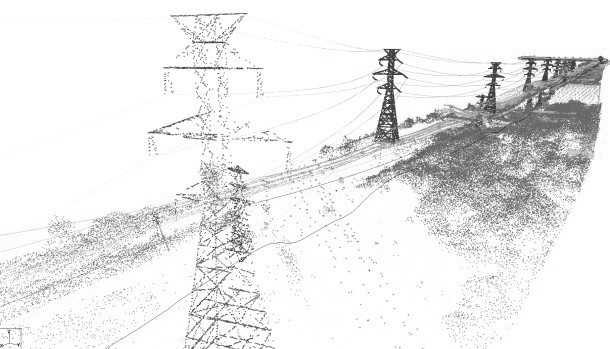
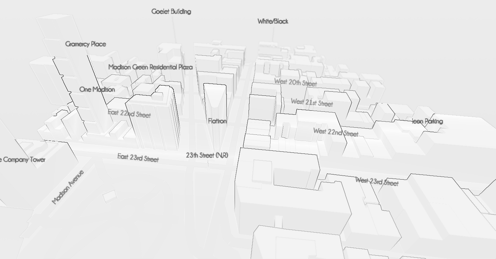
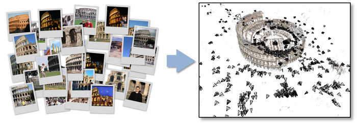
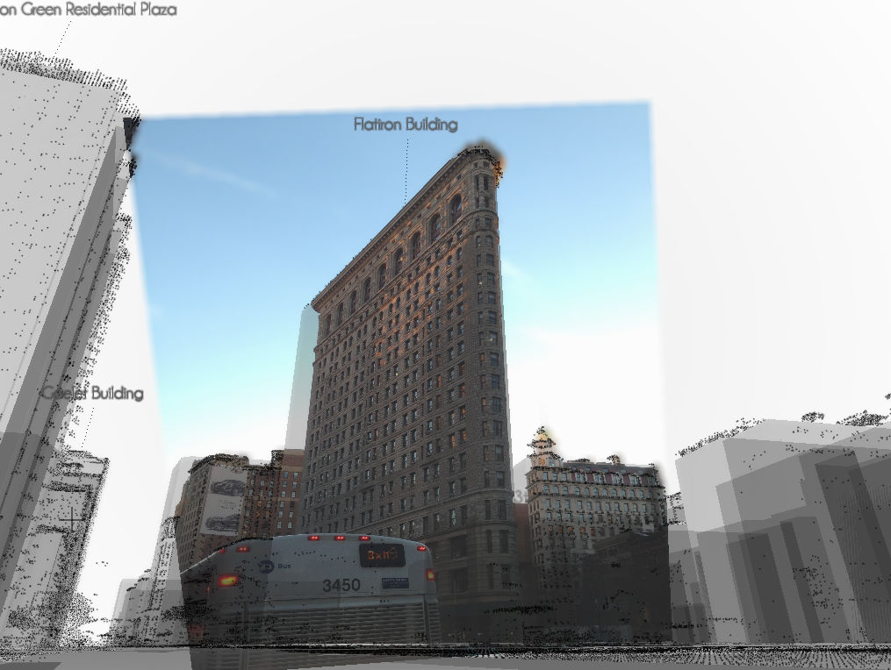
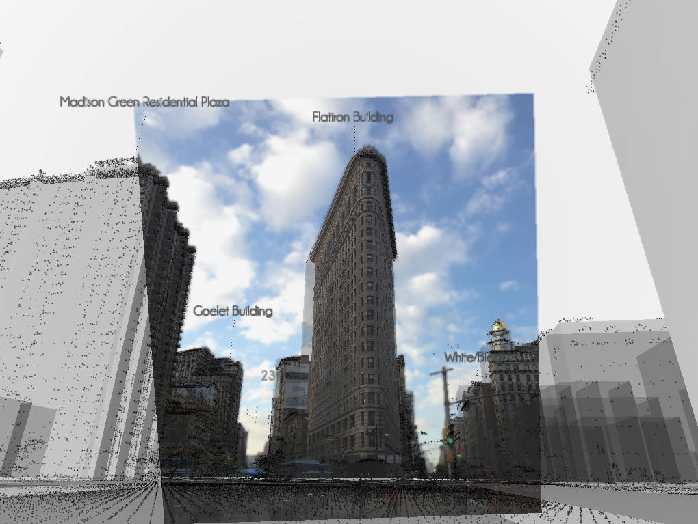
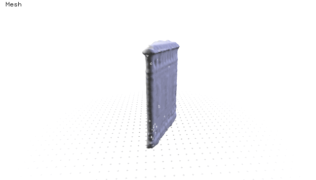

## Non traditional 3D Mapping
##### From pointClouds to GeoJSON Polygons

<iframe src="//player.vimeo.com/video/111857991" width="500" height="281" frameborder="0" webkitallowfullscreen mozallowfullscreen allowfullscreen></iframe>

I know nothing about cartography, beside the general understanding that the earth is not flat but maps are. That there are complicated equations, call projections, to make measurements “feet” in a two dimensional representations usually call map. That’s all.  

I had spend the last month exploring how points cloud can be use on mapping. Why point clouds? Well, I know some Computer Graphics and starting from it seams like the most intuitive way of learning. This article is a documentation of a series of Python and C++ sketches that illustrate my process of the last month.

### Working with Point Clouds

PointClouds are not new, but are pretty much on trending right now. New devices together with the capabilities of storing more date are making this technology more and more common. For me this adventure start on 2011 when I acquire a Microsoft Kinect camera. A cheap and easy to hack devices that use structured light to get depth information of a stream of video. Making point clouds of it was easy and gratifying.

The new products where presented to the market like Google’s [Tango Project](https://www.google.com/atap/projecttango/#project), [Leap Motion](https://www.leapmotion.com/) and [Structure](http://structure.io/). Together with the hardware new open software was develop, like 
[freenect](http://openkinect.org/wiki/Main_Page), [openNI](http://structure.io/openni) and [libPCL](http://pointclouds.org/).

A new generation of artist is playing with this stuff pushing the boundaries of the expressive potential of this technology.

#### LIDar data

Way before the Kinect came to the market, point clouds where use to map thanks to a technology develop on the earlier ’60 call Lidar (Light Detection and Ranging). It consist basically on an expensive laser mounted under planes that send pulses of laser light to the surface of a terrain measuring the distance. That information then is geolocated using precise GPS information, the result is a set of millions of points each one perfectly geolocated in 3D space.

This data can be use to make maps as is shown in [Yuriy Czoli’s tutorial](https://gist.github.com/YKCzoli/3605e014b8ed09a571e5) using openSource software. In it Yuriy explain how to port the points to a PostGIS server and then using QGIS extract and use those points. The final touch is to extract the maximum altitud of the points for each building, that information can be feed to [OpenStreetMap](http://www.openstreetmap.org/). Is that data (the polygons and height per building) what we use in [Mapzen](www.mapzen.com) to generate our 3D maps in [tangram](https://mapzen.com/tangram#mapzen,40.70531887544228,-74.00976419448854,16).

But this is not the path I follow. Coming from a more artistic approach and not knowing much about GIS, I decide to try my own way into this technology. For that I made a series of scripts and tools in this [repo](https://github.com/tangrams/LIDar-tools) to teach my self how to convert Lidar data to other formats, [export it to PostGIS](https://gist.github.com/patriciogonzalezvivo/229c5cd4001c2ed45ec6) and finally extract single buildings by query.

#### Making point-clouds from pictures

While I was proud of my own set of [lidar tools](https://github.com/tangrams/LIDar-tools) thought “How owns a LIDar?”. Well they are expensive devices. I don’t hove one, nobody I know have one.

That’s where photogrammetry came to my mind. This is also a relative old technology ( presented around the 2006), photogrammetry aims to construct 3D point clouds just from photographies. 

What to do if you can’t afford a LIDar devices?

About SfM

[Bundler](http://www.cs.cornell.edu/~snavely/bundler/)

<iframe width="420" height="315" src="//www.youtube.com/embed/vpTEobpYoTg" frameborder="0" allowfullscreen></iframe>

Geo locating PointClouds

<iframe src="//player.vimeo.com/video/110926839" width="500" height="281" frameborder="0" webkitallowfullscreen mozallowfullscreen allowfullscreen></iframe>

What tools are?

* [MeshLab](http://meshlab.sourceforge.net/)

* [CloudCompare](http://www.danielgm.net/cc/)

### From Point Clouds to Meshes

Poisson Reconstructure

[CGAL Poisson reconstruction](http://doc.cgal.org/latest/Surface_reconstruction_points_3/)

[xyz2Mesh](https://github.com/tangrams/LIDar-tools/tree/master/xyz2mesh)

### Meshes to GeoJSON Polygons

Slicing a mesh 

