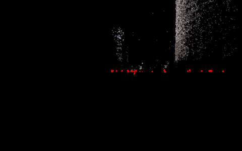
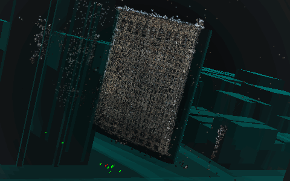
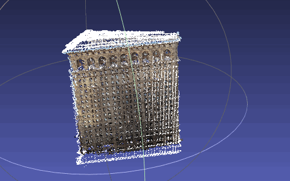
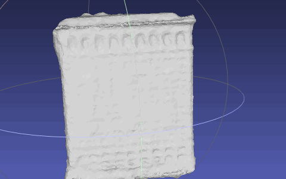
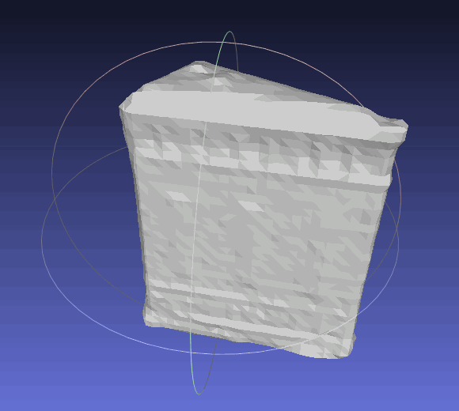
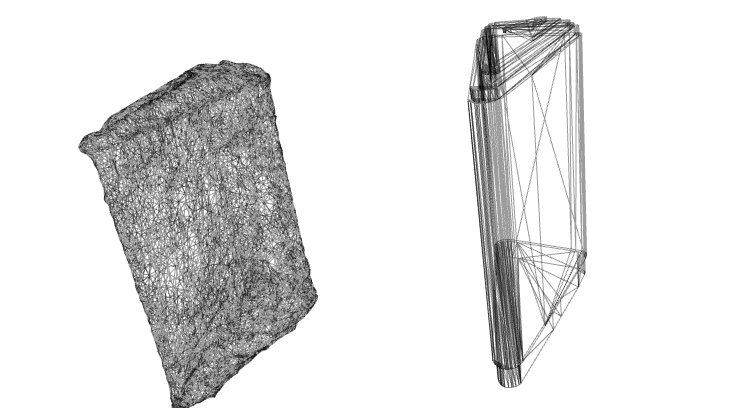
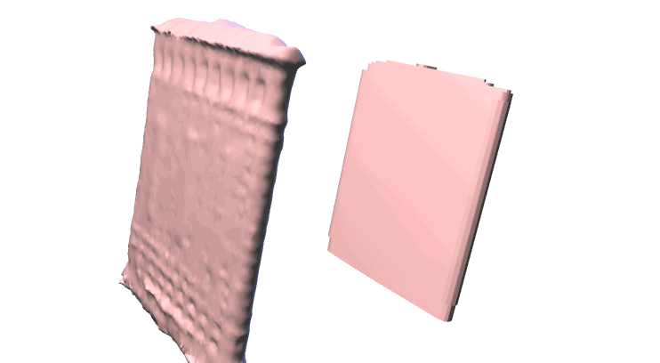

## Non traditional 3D Mapping
From pointClouds to GeoJSON Polygons

### Point Clouds data

What point clouds is? Why is cool?

What can be done?

#### LIDar

[Loading OSM and LIDar to PostGIS](https://gist.github.com/patriciogonzalezvivo/229c5cd4001c2ed45ec6)

#### Structure from Motion

[VisualSfM on MacOS](https://github.com/tangrams/VisualSFM_OS_X)

[ofxBundle](https://github.com/patriciogonzalezvivo/ofxBundle)

Geo locating PointClouds

Exporting to xyz

### Point Clouds to Meshes

[xyz2Mesh](https://github.com/tangrams/LIDar-tools/tree/master/xyz2mesh)

MeshLab

### Meshes to GeoJSON Polygons

