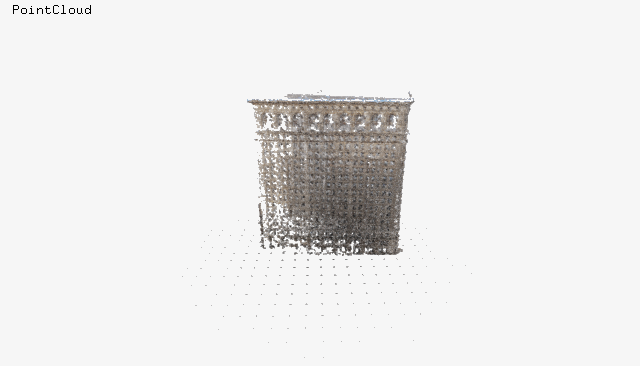

## Non traditional 3D Mapping
##### From pointClouds to GeoJSON Polygons

<iframe src="//player.vimeo.com/video/111857991" width="500" height="281" frameborder="0" webkitallowfullscreen mozallowfullscreen allowfullscreen></iframe>

### Working with Point Clouds

What tools are?

[libLAS](http://www.liblas.org/)
[libPCL](http://pointclouds.org/)
[MeshLab](http://meshlab.sourceforge.net/)
[CloudCompare](http://www.danielgm.net/cc/)

#### LIDar data

Light Detection and Ranging

[LIDar-Tools](https://github.com/tangrams/LIDar-tools)

[Loading OSM and LIDar to PostGIS](https://gist.github.com/patriciogonzalezvivo/229c5cd4001c2ed45ec6)

#### Making point-clouds from pictures

What to do if you can’t afford a LIDar devices?

About SfM

[Bundler](http://www.cs.cornell.edu/~snavely/bundler/)

<iframe width="420" height="315" src="//www.youtube.com/embed/vpTEobpYoTg" frameborder="0" allowfullscreen></iframe>

Geo locating PointClouds

<iframe src="//player.vimeo.com/video/110926839" width="500" height="281" frameborder="0" webkitallowfullscreen mozallowfullscreen allowfullscreen></iframe>

### From Point Clouds to Meshes

Poisson Reconstructure

CGAL

[xyz2Mesh](https://github.com/tangrams/LIDar-tools/tree/master/xyz2mesh)

### Meshes to GeoJSON Polygons

Slicing a mesh 

